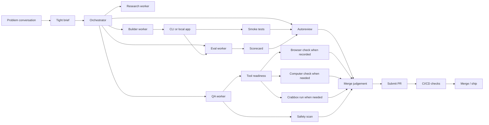

# How I Engineer

A public-safe version of how I ship AI-assisted projects with agents.

The shape is:

```text
conversation -> tight brief -> smallest slice -> orchestrator if needed -> build -> eval -> autoreview -> proof -> PR -> CI/CD -> merge
```

The reference case is TeachClaw: real product work where the useful result had
to survive teacher workflow judgement, eval gates, runtime proof, visible-path
proof when recorded, and clean release boundaries.

This repo does not publish TeachClaw private source, prompts, teacher data,
pupil work, deployment details, Crabbox leases, browser sessions, or live run
logs. It publishes the operating pattern in a scrubbed, runnable form.

## What This Proves

This is not a prompt dump. It is an agent-operable repo that shows:

- how I turn messy conversation into a buildable brief
- how an orchestrator splits work into bounded worker lanes
- how deterministic scripts stay as the source of truth
- how evals judge output quality, routing, and fallback behavior
- how autoreview catches scope creep, overbuilding, and overclaimed proof
- how proof surfaces stay separate: CLI, tests, eval, browser, computer, tool-readiness, Crabbox, autoreview, safety
- how public-safe artifacts are scrubbed before PR/ship

Run the whole public proof chain:

```bash
make check
```

## Operating Model



## The Conversation Comes First

Before orchestration, I use the conversation to find the real shape of the job:

- who is stuck
- what they do manually today
- what input they already have
- what output would actually save time
- where judgement matters
- what the system must never do automatically
- what proof would make the result trustworthy

That conversation becomes the brief. Only then does multi-agent execution help.

## The Agent Roles

**Problem Conversation**

Turns a vague workflow into a grounded slice: user, pain, input, output, risk,
limits, and proof.

**Orchestrator**

Defines the worker lanes, acceptance tests, non-goals, allowed data, and what
evidence will count.

**Research Worker**

Checks workflow reality: what the user currently does, what data shape exists,
what a useful output looks like, and what should be rejected as too broad.

**Builder Worker**

Implements the smallest useful CLI or local app with deterministic logic first.
AI is added only where judgement, extraction, rewriting, ranking, or critique
improves the result.

**Eval Worker**

Runs scenario packs, rubrics, prechecks, pairwise comparisons, and scorecards.
This is where "the output exists" becomes "the output is useful enough, or it
needs repair, or it needs human judgement."

**Autoreview Worker**

Reviews the artifact against the brief after build/eval work. It challenges
scope creep, unnecessary abstractions, broad integrations, AI where deterministic
logic is enough, proof claims that outrun evidence, and public-safety leaks.

**Crabbox Runner**

[Crabbox](https://crabbox.sh/) is public: a short-lived remote testbox flow for
leasing a box, hydrating the required tools, syncing the working tree,
verifying the toolchain, running commands, collecting proof artifacts, and
releasing the box.

In real projects, I use Crabbox when local proof is not enough: run tests away
from my laptop, check browser paths, verify tool readiness, collect
screenshots/logs/test summaries, and keep proof separate from my normal
workspace. This repo shows that habit without publishing broker URLs, provider
choices, lease IDs, private tool manifests, private MCP configs, private paths,
customer data, auth material, screenshots, or live run logs.

**QA Worker**

Tries to break the artifact. It checks setup, failure modes, generated outputs,
docs, `.env` boundaries, proof claims, leak-prone files, and whether the right
visible-session tools are available for the proof.

**Browser E2E Worker**

When browser proof is recorded, it tests the owner-facing path with Browser
Use-style tooling: open the tool, enter realistic inputs, run the automation,
download the output, and inspect the rendered result.

**Computer Use Worker**

When the path leaves normal browser control, it tests the visible desktop or
OS-level flow: file pickers, generated PDFs, downloads, native dialogs, or other
interactions a real user would have to complete. It uses fake data and records
only public-safe evidence.

## Runnable Reference Examples

### TeachClaw Proof Loop

Path: `examples/teachclaw-scrubbed-proof-loop`

Shows the workflow mechanics: fake teacher request, fake evidence, artifact
plan, validation gates, safety boundaries, and human judgement checkpoint.

```bash
cd examples/teachclaw-scrubbed-proof-loop
make smoke
python3 -m pytest -q
```

### TeachClaw Eval Harness

Path: `examples/teachclaw-scrubbed-eval-harness`

Shows the eval spine: fake scenario pack, weighted rubric, two candidate
strategies, deterministic scoring, pairwise winners, scorecard output, and
explicit non-claims.

```bash
cd examples/teachclaw-scrubbed-eval-harness
make smoke
python3 -m pytest -q
```

The generated scorecard makes the judgement visible:

- single-pass draft: faster, cheaper, not ready
- draft plus checker plus targeted repair: higher quality, still review-gated
  where the scenario is risky

That is the point. Good engineering does not force confidence when the correct
answer is "mechanically sound, but still needs judgement."

## Why This Is Different

Most AI demos stop at "the model said something plausible."

This repo pushes further:

- problem conversation before orchestration
- repo-root agent routing through `AGENTS.md` and `codex/how-i-engineer/LOAD-FIRST.md`
- task skills under `.agents/skills`
- structured brief before implementation
- deterministic core before AI
- worker-style separation of research, build, eval, QA, browser, computer, and PR/ship
- autoreview for brief fit, minimality, overengineering, proof claims, and safety
- real-user QA that checks Browser Use or Computer Use readiness before claiming visible-path proof
- runnable eval harness with scenario packs, rubrics, fatal gates, and scorecards
- reproducible smoke path
- Crabbox-backed proof language for isolated remote execution
- browser and computer proof language that separates recorded visible checks from CLI proof
- safety scan before PR/ship
- explicit refusal to scrape private systems, send emails, write CRMs, or publish live actions by default

## What's In The Repo

| Path | What It Shows |
| --- | --- |
| `README.md` | The public version of my engineering loop: conversation, brief, orchestrator, workers, eval, proof, PR, CI/CD, merge. |
| `AGENTS.md` | The root router for future agents working inside this public artifact. |
| `codex/how-i-engineer/LOAD-FIRST.md` | Lightweight startup route: load the kernel, pick one skill, inspect current truth. |
| `codex/how-i-engineer/KERNEL.md` | The compact operating doctrine: promise, truth model, autonomy boundary, slice rule, evidence ladder. |
| `.agents/skills/` | Task-specific operating procedures for conversation briefs, workflow shipping, orchestration, autoreview, real-user QA, evals, Crabbox proof, and PR/ship safety. |
| `ops/evals/` | Eval contract for scenario packs, rubrics, scorecards, and source-of-truth labels. |
| `ops/contracts/validation-gates/` | Mechanical, eval, quality, source-of-truth, and merge verdict rules. |
| `ops/contracts/worker-briefs/` | Worker brief shape for handing off bounded lanes. |
| `docs/eval-framework.md` | How the eval spine works and what it proves. |
| `docs/agentic-build-loop.md` | The step-by-step loop from problem conversation to PR/ship gate. |
| `docs/orchestrator-worker-system.md` | How I split work across orchestrator, research, builder, eval, QA, browser, computer, Crabbox, autoreview, and PR/ship lanes. |
| `docs/crabbox-runs.md` | How Crabbox fits the workflow, using only public-safe detail. |
| `docs/qa-browser-e2e.md` | The proof ladder and how to avoid vague "tested" claims. |
| `docs/pr-ship-safety.md` | What must pass before submitting a PR or shipping. |
| `docs/what-not-to-publish.md` | The scrub boundary: what stays out of public repos. |
| `templates/automation-brief.md` | A reusable brief shape for turning a conversation into worker-ready scope. |
| `examples/teachclaw-scrubbed-proof-loop/` | A runnable public-safe TeachClaw proof-loop example. |
| `examples/teachclaw-scrubbed-eval-harness/` | A runnable public-safe TeachClaw eval harness with scorecards and tests. |
| `scripts/public_safety_check.py` | A scanner for secrets, private paths, generated junk, and obvious leak risks. |
| `scripts/verify_examples.py` | The root verification runner used by `make check`. |

## Checks

Run the public proof chain from the repo root:

```bash
make check
```

This currently runs:

- GitHub Actions CI on push and pull request
- repo doctor for agent routing, skills, contracts, and required files
- proof-loop smoke tests
- proof-loop unit tests
- eval-harness smoke tests
- eval-harness unit tests
- public safety scan for secrets, local paths, private-workspace markers, generated release junk, and accidental binary artifacts

Browser E2E, Computer Use, tool-readiness, and Crabbox proof are part of the
operating model, but they should only be claimed for a PR or ship decision when
those runs have actually been recorded.
Autoreview is a procedural gate for non-trivial changes; it is recorded as a
review verdict, not faked as an automated test.

## Public-Safe By Design

This repo shows the engineering pattern without exposing private operating
details.

It intentionally excludes:

- private customer data
- real inboxes, DMs, browser profiles, cookies, or session data
- private agent prompts, hidden scratchpads, and internal work logs
- API keys and local `.env` files
- generated zip releases unless intentionally scanned
- private product strategy or implementation details

## Repo Shape

```text
.agents/
  skills/
codex/
  how-i-engineer/
examples/
  teachclaw-scrubbed-proof-loop/
  teachclaw-scrubbed-eval-harness/
docs/
  agentic-build-loop.md
  crabbox-runs.md
  eval-framework.md
  orchestrator-worker-system.md
  qa-browser-e2e.md
  pr-ship-safety.md
  what-not-to-publish.md
templates/
  automation-brief.md
ops/
  contracts/
  evals/
scripts/
  repo_doctor.py
  public_safety_check.py
  verify_examples.py
```

## PR Rule

Work can be messy locally; the PR cannot be. Submit a scoped PR, let CI/CD run
the proof chain, and merge only when claims match recorded evidence.
